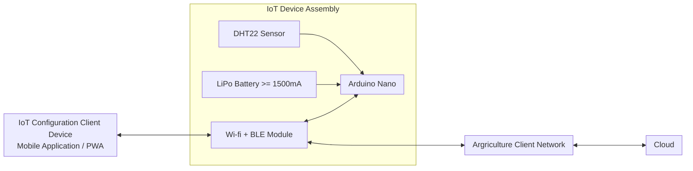
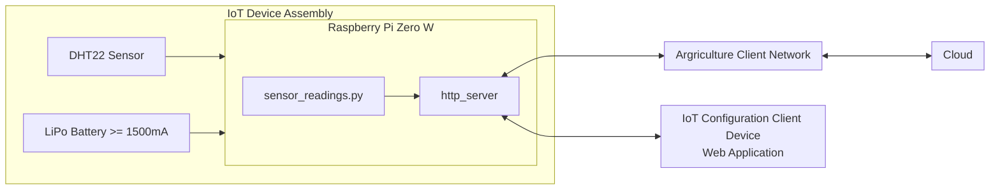
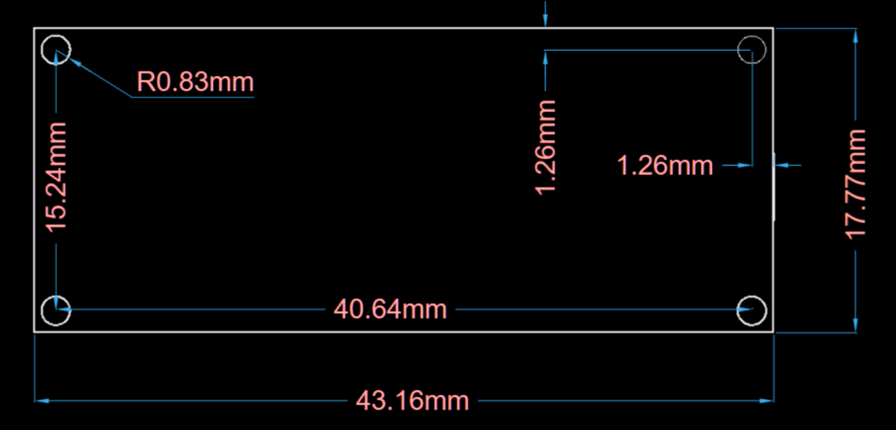

# L1 Mechatronics Engineer Techinical Design Round

[Technical Design Round Information](./L1-Mechatronics-Engineer-Technical-Design-Round.pdf)

## Part 1 - Hardware

### Microcontroller and Components (Arduino Nano vs. Raspberry Pi Zero W)

##### Arduino Nano

###### Pros

- Low energy consumption
- Smaller form factor
- Cheaper

###### Cons

- External module needed for Wi-fi and Bluetooth capabilities
- Slower processing speeds
- Slower development time (C/C++ and Arudino IDF)
- Lack of wi-fi and bluetooth capabilities

###### Diagram Showing Solutions Architecture for Arduino Nano

##### Raspberry Pi Zero W

###### Pros

- Built-in wi-fi and bluetooth capabilities
- Headless communication and programming (SSH)
- Faster processing speeds
- More memory
- Quicker development time (Python and Bash)

###### Cons

- Heavy power consumption
- Difficult consumer interaction implementation/Human Machine Interface (HMI)
- Bigger form factor
- Costs more

The Raspberry Pi Zero W utilizes Linux and Python,
which increase development/prototyping time but
has a more difficult human machine interface for consumers.
The device has to be configured in a headless fashion (POSIX CLI and SSH)
and even the hassle of initially connecting to an existing network (SNMP adapters, iwctl,
etc...).

To minimize difficulty, a web application can be made and hosted on the device itself,
allow connectivity to the device via it's access point (WLAN).
This also increases development time and a better development experience overall
(dealing with appstore publishing, decoupled client;
restrict information being saved in a personal application asuming the client
does not having a centralized client for controlling multiple devices).
Another possibility is the use of [Home Assistant](https://www.home-assistant.io/).

###### Diagram Showing Solutions Architecture for Raspberry Pi Zero W

##### Final Choice

Although both microcontrollers are great,
the Raspberry Pi Zero W uses additional power in this scenario
but the Arduino Nano lacks wi-fi capabilities which is essential for this project,
an additional module can be added but that increases the form factor and development time.

The microcontroller chosen is a Arduino Nano 33 IoT because it has the functionalites
and benefits of a standard Arduino Nano with built-in wi-fi and bluetooth capabilities.

## Enclosure Design

### Diagram of Arduino Nano 33 IoT Dimensions

## Part 2 - Software