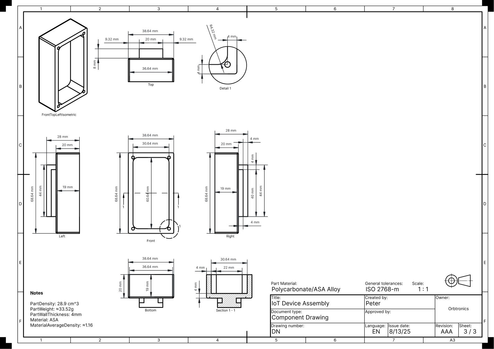

# L1 Mechatronics Engineer Techinical Design Round

[Technical Design Round Information](./L1-Mechatronics-Engineer-Technical-Design-Round.pdf)

## Part 1 - Hardware

### Microcontroller and Components (Arduino Nano vs. Raspberry Pi Zero W)

##### Arduino Nano

###### Pros

- Low energy consumption
- Smaller form factor
- Cheaper

###### Cons

- External module needed for Wi-fi and Bluetooth capabilities
- Slower processing speeds
- Slower development time (C/C++ and Arudino IDF)
- Lack of wi-fi and bluetooth capabilities

###### Diagram Showing Solutions Architecture for Arduino Nano

##### Raspberry Pi Zero W

###### Pros

- Built-in wi-fi and bluetooth capabilities
- Headless communication and programming (SSH)
- Faster processing speeds
- More memory
- Quicker development time (Python and Bash)

###### Cons

- Heavy power consumption
- Difficult consumer interaction implementation/Human Machine Interface (HMI)
- Bigger form factor
- Costs more

The Raspberry Pi Zero W utilizes Linux and Python,
which increase development/prototyping time but
has a more difficult human machine interface for consumers.
The device has to be configured in a headless fashion (POSIX CLI and SSH)
and even the hassle of initially connecting to an existing network (SNMP adapters, iwctl,
etc...).

To minimize difficulty, a web application can be made and hosted on the device itself,
allow connectivity to the device via it's access point (WLAN).
This also increases development time and a better development experience overall
(dealing with appstore publishing, decoupled client;
restrict information being saved in a personal application asuming the client
does not having a centralized client for controlling multiple devices).
Another possibility is the use of [Home Assistant](https://www.home-assistant.io/).

###### Diagram Showing Solutions Architecture for Raspberry Pi Zero W

##### Final Choice

Although both microcontrollers are great,
the Raspberry Pi Zero W uses additional power in this scenario
but the Arduino Nano lacks wi-fi capabilities which is essential for this project,
an additional module can be added but that increases the form factor and development time.

The microcontroller chosen is a Arduino Nano 33 IoT because it has the functionalites
and benefits of a standard Arduino Nano with built-in wi-fi and bluetooth capabilities.

## Enclosure Design

The enclosure [top half](./cad/export/Assembly_IoTDevice_Enclosure_Top.stl) and
[bottom half](./cad/export/Assembly_IoTDevice_Enclosure_Bottom.stl) can be viewed in the browser.

### Material Choice

The enclosure was designed with manufacturability in mind, specifically for 3D printing
using an [ASA/Polycarbonate alloy](https://www.matweb.com/search/DataSheet.aspx?MatGUID=99370cc98ea74464a72481d4289db059&ckck=1). ASA offers mechanical strength, impact resistance,
and UV stability superior to ABS, while also outperforming PLA in humidity resistance and PETG in impact resistance.
Wall thickness is set at 4 mm to ensure robustness while keeping print time reasonable.
Internal openings include 1–2% tolerance to accommodate battery expansion over time, with a pull-tab for easy removal.
A sliding mechanism allows the main device body (male version) to dock into interchangeable female adapters for wall mounting or pole clamping.

For environmental sealing, the enclosure integrates a 2 mm silicone gasket channel (1 mm per mating side), providing splash resistance up to IP54+.
Gaskets can be produced via extrusion or replaced with gasket maker for a low-cost, field-serviceable option.
Additional gasket channels are added to USB and sensor openings for extra ingress protection.

### Mass Manufacturing Approach

For larger-scale production, the enclosure design can be adapted for injection molding using the same ASA/PC blend,
reducing per-unit costs after tooling. Gaskets could be mass-produced via extrusion or molded in bulk.
Bulk procurement of electronics and mechanical components, as listed in the Bill of Materials, will further reduce costs.
Assembly would be simplified by the modular design, with the battery connected via a JST 2-pin connector for quick installation or replacement.

### Maintenance Considerations

Field maintenance is simplified through design features such as the pull-tab battery removal,
easily accessible JST connectors, and standard screw fittings for enclosure access.
The modular mounting system allows rapid swap-out of the main unit without uninstalling the mounting hardware.

### Technical Drawings of IoT Device Assembly

### Wiring Diagram of IoT Device Assembly

## Part 2 - Software